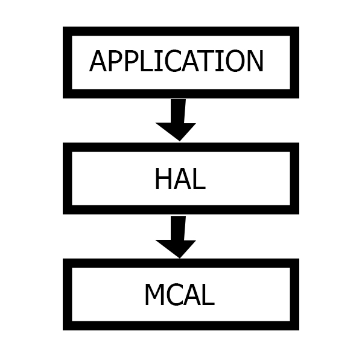
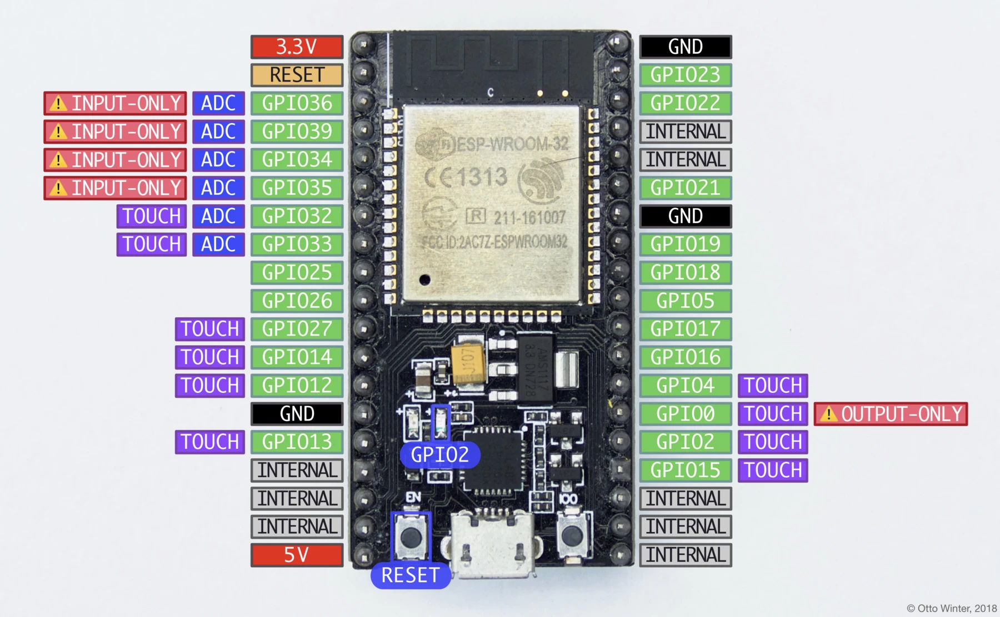
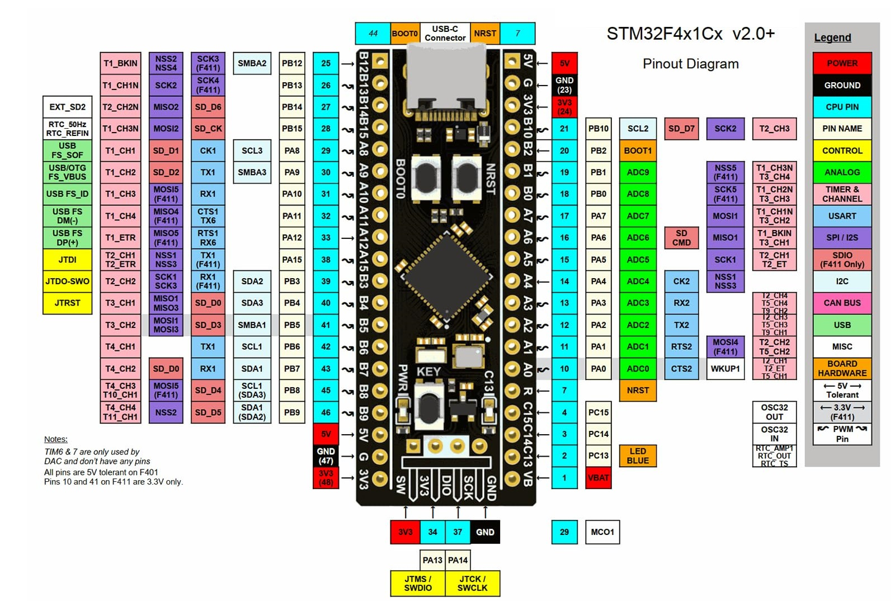
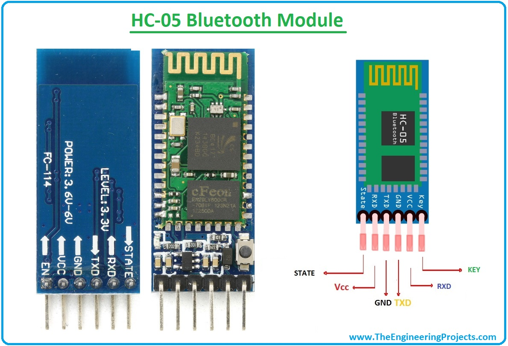

# Firmware Over-The-Air (FOTA)
# Using Automotive CyberSecurity Techniques for Smart Vehicles


### Cairo University, Faculty of Computers and Artificial Intelligence  
**Department of Information Technology**  
**Graduation Project 2023-2024**  

**Team Members:**  
- Kareem Abd El-Moneam Fawzy Yassin  
- Mahmoud Alaa Eldeen Fathy Sadek  
- Mohammed Gabr Ahmed Khamis  
- Salma Sherif Ibrahim Moustafa  
- Ahmed Adel Emad Eldeen Farag  
- Zyad Mahmoud Abbady Amin  

**Supervisor:**  
PhD. Haitham Safwat Hamza, Vice-Dean for Postgrad and Research, Cairo University


---

## Sample Video of FOTA Workflow

Here is a sample video demonstrating the FOTA system in action:

[](https://raw.githubusercontent.com/KareemMoneeam/FOTA/main/FOTA%20Workflow.mp4)


---

## Table of Contents
1. [Project Overview](#project-overview)
2. [System Architecture](#system-architecture)
3. [Key Features](#key-features)
4. [Technologies Used](#technologies-used)
5. [Hardware Components](#hardware-components)
6. [Software Components](#software-components)
7. [FOTA System Flow](#fota-system-flow)
8. [Automotive Cybersecurity](#automotive-cybersecurity)
9. [Installation](#installation)
10. [Usage](#usage)

---

## Project Overview

This project involves the development of a Firmware Over-The-Air (FOTA) system for smart vehicles, enabling secure, efficient, and remote software updates. The project aims to address the complexities of embedded systems in modern automobiles, focusing on enhancing user experience, maintaining vehicle safety, and ensuring cybersecurity.

Modern vehicles rely heavily on embedded systems and electronic control units (ECUs) to manage various functionalities, from engine performance to advanced driver assistance systems. The evolution of smart cars has introduced the need for real-time adaptability through FOTA systems, which allow for seamless and secure software updates.

---

## System Architecture

The project employs a layered architecture, featuring two main views:
- **Main ECU:** Manages the overall system and controls various peripherals.
- **Application ECU:** Executes application logic, including obstacle detection and avoidance using sensors and actuators.

### Components:
- **Microcontroller Abstraction Layer (MCAL):** Manages hardware specifics.
- **Hardware Abstraction Layer (HAL):** Interfaces with physical hardware components.
- **Application Layer:** Implements vehicle control and safety features.



---

## Key Features

- **Real-time Firmware Updates:** Ensures vehicles are equipped with the latest software enhancements.
- **Automotive Cybersecurity:** Includes secure boot and encryption protocols to protect against unauthorized access.
- **User-Friendly Mobile Application:** Allows users to manage updates, report problems, and receive notifications directly from the vehicle's dashboard.

---

## Technologies Used

The project utilizes various technologies to create a robust FOTA system:

### 1. Django - FOTA Server
Django is used to develop the backend server that manages firmware updates and user interactions.


### 2. NodeMCU ESP32 - Gateway Communication
NodeMCU ESP32 serves as the gateway between the vehicle's main ECU and the FOTA server, enabling Wi-Fi connectivity for updates.



### 3. STM32F401RCT6 - Main and Application ECUs
The STM32F401RCT6 microcontroller is the core component for managing the vehicle's embedded systems.



### 4. HC-05 Bluetooth Module
Used for wireless communication between the vehicle and mobile applications.



### 5. Mobile Application
Developed to provide a user-friendly interface for managing updates and system notifications.

---

## Hardware Components

- **STM32F401RCT6 Microcontroller:** Serves as the core processing unit, managing both the main and application ECUs.
- **NodeMCU ESP32:** Acts as a gateway for receiving updates from the server.
- **HC-05 Bluetooth Module:** Facilitates communication between the vehicle and mobile devices.
- **Ultrasonic Sensor:** Detects obstacles for navigation and safety.
- **H-Bridge Motor Driver:** Controls the vehicle's DC motors for movement.

---

## Software Components

- **FOTA Server (Django):** Manages the distribution and deployment of firmware updates.
- **Secure Bootloader:** Validates and loads authenticated firmware onto the ECUs.
- **Mobile Application:** Provides an interface for vehicle owners to interact with the FOTA system.

---

## FOTA System Flow
## Scenarios

### Scenario 1: User-Driven Non-Critical Update
The OEM introduces a non-critical firmware feature that vehicle owners can either accept or snooze through the user interface. If accepted, the firmware is transmitted via Node MCU, and the bootloader handles the update on the target ECU. If snoozed, a countdown timer starts in the Main ECU, prompting a reminder notification on the dashboard when the snooze period ends.

### Scenario 2: Critical Update
For critical updates, the process is automatic. The update is initiated without user intervention, and the Main ECU flashes the update to the target ECU. A dashboard notification informs the vehicle owner that the update is in progress, ensuring important updates are applied quickly and securely.

### Scenario 3: Issue Reporting & Support
If a user reports a problem through the dashboard, the OEM assesses the issue and either provides a relevant firmware update or troubleshooting instructions. If an update is required, it is transmitted and flashed to the target ECU. If the issue persists, the Main ECU leverages Google Maps API to display nearby service stations based on the user's location.


---

## Automotive Cybersecurity

The FOTA system employs robust automotive cybersecurity techniques to protect vehicles from potential cyber threats. These security measures include:

1. **Secure Boot:**
   - Ensures that only authenticated firmware is executed on the ECUs. The bootloader verifies the integrity and authenticity of the firmware before installation, preventing unauthorized or malicious software from running on the vehicle's system.

2. **AES-256 Encryption:**
   - Firmware updates are encrypted using AES-256 during transmission between the FOTA server and the vehicle’s ECU. This ensures that even if the data is intercepted, it remains unreadable to unauthorized entities.

3. **RSA Digital Signatures:**
   - All firmware updates are signed with RSA digital signatures. The ECU verifies the digital signature before accepting the update, ensuring the update's authenticity and protecting against tampering.

4. **Firmware Integrity Checks:**
   - After the update is applied, the system performs integrity checks to confirm that the firmware has not been altered. This ensures the vehicle is running the correct, unmodified version of the software.

---

## Installation

To set up the FOTA system, follow these steps:

1. **Clone the repository:**
   ```bash
   git clone https://github.com/KareemMoneeam/FOTA.git
2. **Set up the hardware** according to the pinout configuration in the documentation.
3. **Flash the microcontroller** with the bootloader firmware using the provided scripts.
4. **Deploy the FOTA server** on your preferred hosting environment.

## Usage
1. **Connect the vehicle's ECU** to the FOTA server using the NodeMCU ESP32.
2. **Use the mobile application** to check for updates and manage notifications.
3. **Accept or snooze** updates directly from the vehicle's dashboard interface.


For more detailed information, please refer to the [documentation](https://github.com/KareemMoneeam/FOTA/blob/main/Final%20Documentation.pdf).
